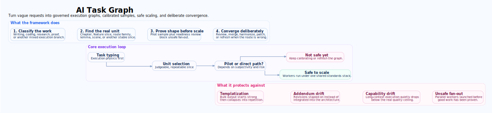
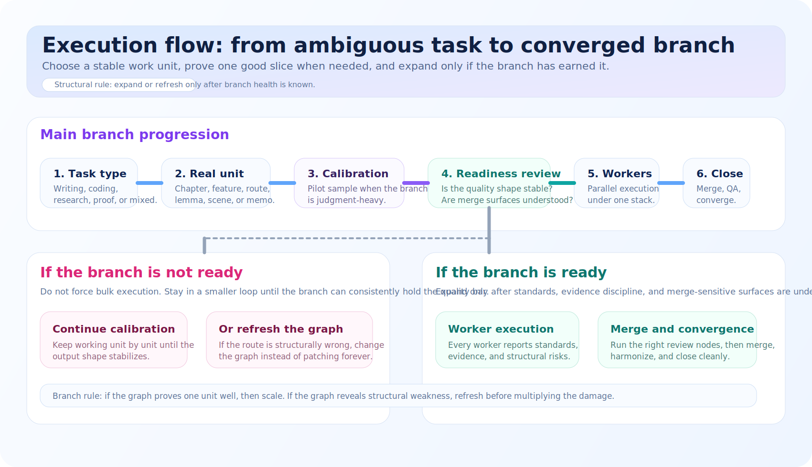
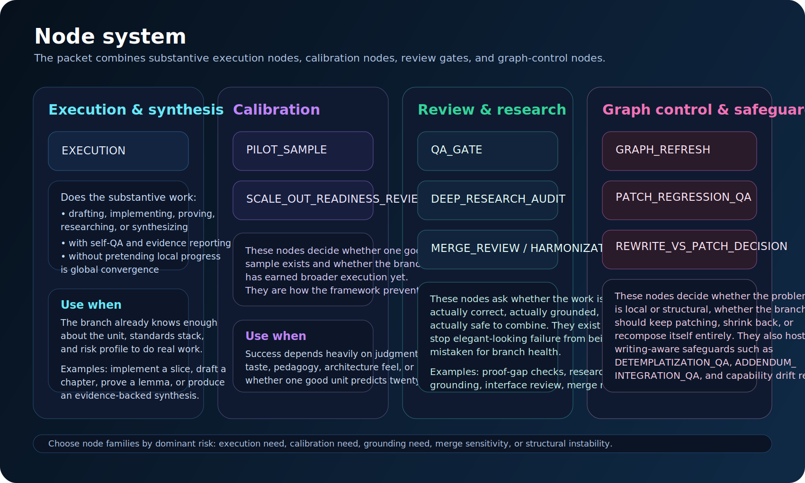

# AI Task Graph

<p align="center">
  
</p>

A structured framework for helping AI agents solve problems through **task graphs** instead of ad hoc continuation.

The framework turns a vague request into:
- a governed execution graph
- well-sized units of work
- pilot-sample calibration before unsafe scale-out
- parallel worker dispatch under shared standards
- built-in review nodes, merge discipline, and graph refresh logic

This repository packages the **v08 task graph orchestration packet** in a GitHub-friendly unpacked Markdown form and presents it as a reusable system you can attach to future AI workflows.

---

## What is a task graph?

A task graph is a structured plan that tells an AI agent:
- **what should happen first**
- **what can safely happen in parallel**
- **what needs calibration before scale**
- **what must be reviewed before merge or finalization**
- **when to patch locally vs refresh the graph itself**

Instead of saying “continue” and hoping quality stays high, the framework makes the agent explicitly reason about:
- task type
- governing standards
- the real fundamental unit of work
- readiness for bulk or parallel execution
- evidence and QA obligations at each node

---

## Why this exists

Many AI workflows degrade when the task gets large:
- long writing runs start strong and then collapse into templated repetition
- revisions become append-only addenda instead of true integration
- the system forgets its own standards, chapter contracts, or quality bar
- later units shrink, flatten, or drift from the earlier good sample
- parallel generation creates merge problems because shared surfaces were not governed

This framework is designed to stop that.

---

## Core idea: calibrate before you scale

<p align="center">
  
</p>

The packet’s strongest doctrine is **calibration-first scaling**:

1. classify the branch
2. identify the real fundamental unit of work
3. generate a representative pilot sample
4. run a scale-readiness review
5. only then expand into larger batches or parallel workers

For a book, the default unit is usually the **chapter**. For a coding branch, it may be a **feature**, **subsystem**, or **design slice**. For proof work, it may be a **claim** or **proof segment**.

The framework assumes that “dependency order” is **not enough**. Healthy execution size must also be chosen deliberately.

---

## Start here

If you want to try the framework quickly instead of reading everything first, start here:

- [Start here index](start-here/README.md)
- [Quickstart](start-here/quickstart.md)
- [First task graph prompt](start-here/first-task-graph-prompt.md)
- [Choosing a unit of work](start-here/choosing-a-unit-of-work.md)

This is the fastest path from “I understand the idea” to “I can use this on a real task.”

---

## What the framework can do

- Build task graphs for writing, coding, research, diagram-heavy, and mixed-mode work
- Force AI agents to report which standards and evidence governed each node
- Require built-in self-QA inside every execution node
- Insert stronger review nodes only where they are actually needed
- Block unsafe fan-out until a pilot sample proves the output shape is stable
- Coordinate parallel worker chats under one orchestrator
- Detect when the graph itself should change instead of endlessly patching local outputs
- Add writing-specific safeguards for templatization, addendum drift, capability drift, and whole-system coherence

---

## Node system

<p align="center">
  
</p>

### Core execution and control nodes
- `EXECUTION`
- `PILOT_SAMPLE`
- `SCALE_OUT_READINESS_REVIEW`
- `QA_GATE`
- `DEEP_RESEARCH_AUDIT`
- `MERGE_REVIEW`
- `HARMONIZATION`
- `GRAPH_REFRESH`

### Writing-aware quality nodes
- `DETEMPLATIZATION_QA`
- `ADDENDUM_INTEGRATION_QA`
- `ASSIMILATION_BALANCE_QA`
- `META_CAPABILITY_DRIFT_ANALYSIS`
- `WHOLE_SYSTEM_COHERENCE_QA`
- `SOURCE_ALIGNMENT_QA`
- `COVERAGE_BALANCE_QA`
- `EXAMPLE_DIVERSITY_QA`
- `VISUAL_TEXT_ALIGNMENT_QA`
- `READER_EXPERIENCE_QA`
- `DENSITY_AND_BLOAT_QA`
- `PATCH_REGRESSION_QA`
- `REWRITE_VS_PATCH_DECISION`

These nodes exist because many AI failures are not “wrong answers.” They are **loss-of-quality-under-scale** failures.

---

## What makes this framework different

### 1. It identifies the real unit of work
A chapter, feature, proof, decision memo, or scene is often the unit that succeeds well. Bulk generation without finding this unit first is where many AI workflows break.

### 2. It treats subjectivity as a first-class signal
If success depends on pedagogy, tone, API shape, architecture taste, UX feel, narrative voice, or visual judgment, the framework prefers a **pilot sample** before bulk work.

### 3. It knows that writing degrades differently than code
Writing-heavy branches activate extra review doctrine for:
- templatization
- accidental addendum behavior
- over-blending during integration
- capability drift in long-context generation
- local polish that hides global weakness

### 4. It makes parallelism earned, not assumed
The framework supports worker fan-out, but only after:
- the standards stack is anchored
- the pilot sample is accepted
- the scale-readiness review says the branch is safe to expand

---

## Explore a canonical example

The repo now includes a real end-to-end example pack that shows how the framework would be applied to a quality-sensitive long-form project.

- [Examples index](examples/README.md)
- [Technical book canonical example](examples/technical-book-canonical/README.md)
- [Generated graph](examples/technical-book-canonical/generated-graph.md)
- [Pilot sample behavior](examples/technical-book-canonical/pilot-sample.md)
- [Scale readiness review](examples/technical-book-canonical/scale-readiness-review.md)
- [Worker prompts](examples/technical-book-canonical/worker-prompts.md)
- [Final convergence](examples/technical-book-canonical/final-convergence.md)

---

## Explore the wiki

The repo also includes a walkthrough-style wiki showing what graphs get generated for different domains and what those graphs do step by step.

- [Wiki home](wiki/README.md)
- [Graph anatomy by domain](wiki/01-graph-anatomy-by-domain.md)
- [Example: technical book project](wiki/02-example-technical-book-project.md)
- [Example: coding feature delivery](wiki/03-example-coding-feature-delivery.md)
- [Example: research analysis and proof work](wiki/04-example-research-analysis-and-proof.md)
- [Parallel execution, merge, and recovery](wiki/05-parallel-execution-and-recovery.md)

---

## Repository layout

```text
.
├── README.md
├── assets/
│   ├── hero-task-graph.svg
│   ├── task-graph-flow.svg
│   └── task-graph-node-system.svg
├── examples/
│   ├── README.md
│   └── technical-book-canonical/
│       ├── README.md
│       ├── task.md
│       ├── generated-graph.md
│       ├── pilot-sample.md
│       ├── scale-readiness-review.md
│       ├── worker-prompts.md
│       └── final-convergence.md
├── packet/
│   └── v08/
│       ├── README.md
│       ├── core_packet.md
│       └── domain_profiles.md
├── start-here/
│   ├── README.md
│   ├── quickstart.md
│   ├── first-task-graph-prompt.md
│   └── choosing-a-unit-of-work.md
└── wiki/
    ├── README.md
    ├── 01-graph-anatomy-by-domain.md
    ├── 02-example-technical-book-project.md
    ├── 03-example-coding-feature-delivery.md
    ├── 04-example-research-analysis-and-proof.md
    └── 05-parallel-execution-and-recovery.md
```

---

## How to use the packet

### Minimal path
1. Attach the packet guide or the general standard.
2. Attach the relevant domain profile if the task has a clear domain.
3. Ask the AI to generate a task graph.
4. Require it to identify the **fundamental unit** and whether calibration is needed.
5. If subjectivity is high, run a **pilot sample** first.
6. Let the graph decide when fan-out is safe.
7. Run the promised review nodes before merge or finalization.

### Stronger path for large projects
1. Attach the full packet.
2. Attach your project handoff or build spec.
3. Ask for a graph with explicit node types, dependencies, evidence expectations, and QA nodes.
4. Accept one calibrated pilot sample.
5. Dispatch parallel worker nodes only after readiness review.
6. Use merge review, harmonization, and graph refresh where needed.

---

## Included packet documents

### Packet files
- **README.md** — reading order, highlights, and routing notes for the unpacked packet
- **core_packet.md** — the merged core packet in Markdown form, covering the guide, quick sheet, general standard, domain-handoff use, worker protocol, review doctrine, and prompt schemas
- **domain_profiles.md** — the merged domain profiles for technical books, books/novels, coding, mathematics, and analytical work

---

## Best fit

This framework is especially strong for:
- technical books and long-form educational writing
- large coding projects that need staged execution and merge discipline
- multi-agent orchestration
- tasks with strong quality subjectivity
- long projects where AI tends to degrade over time

---

## Short philosophy

A good AI workflow should not only ask:
> “What is the next step?”

It should also ask:
- What is the right unit of work?
- Has good quality actually been demonstrated yet?
- Is this branch safe to scale?
- Are we still following the governing standards?
- Are we patching the right thing, or do we need to refresh the graph?

That is what **AI Task Graph** is built to do.
