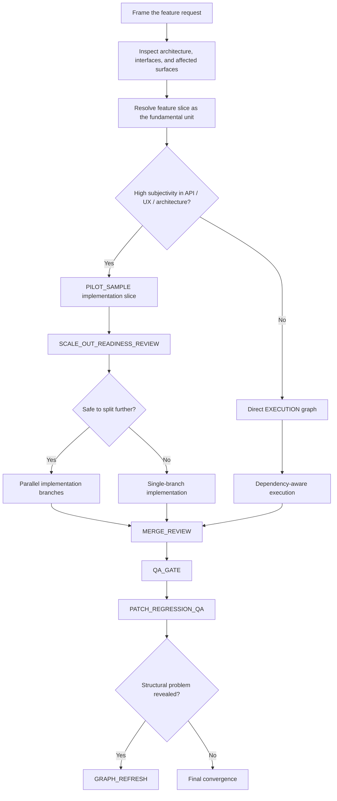

# Generated Graph

This is the graph the framework should generate for the coding-feature task.

## Why this graph shape is correct

The coding branch is governed by a different risk model than the writing branch.

The dominant problems are:
- interface misreads
- regression risk
- unsafe parallelism across shared surfaces
- local patching that hides a deeper structural issue

So the graph focuses on:
- feature-slice selection
- readiness for safe split
- merge review
- regression review
- graph refresh when architecture assumptions break

## Important judgment

This branch does **not** automatically require the full writing-aware review doctrine.

However, if the task includes strong judgment surfaces like:
- public API shape
- UX-heavy interaction flow
- architectural taste

then the graph may still use a `PILOT_SAMPLE` before scaling.

## Why dependency order is still not enough

A weak coding graph might say:
- backend first
- then frontend
- then tests

A stronger graph also asks:
- is the selected feature slice the right unit?
- is this branch safe to split yet?
- are merge-sensitive interfaces already understood?
- are we still dealing with a feature branch, or has the work become structural enough to refresh the graph?
