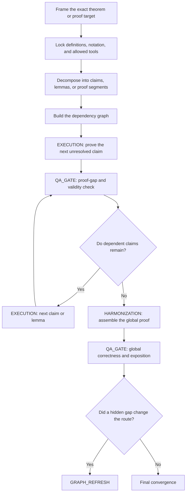

# Generated Graph

This is the graph the framework should generate for a mathematics or proof-heavy task.

## Why this graph shape is correct

This branch is dominated by a different risk than writing, coding, or current-fact analysis.

The main problem is not:
- reader-style drift
- stale evidence
- merge-heavy implementation churn

The main problem is:
- invalid proof leaps
- circular dependence
- missing definitions or tool assumptions
- local correctness that does not produce a globally valid proof

So the graph emphasizes:
- target locking before derivation
- dependency order of claims and lemmas
- local proof-gap QA before treating progress as real
- global proof assembly only after the dependency chain is defensible
- graph refresh when a failed lemma changes the overall route

## Why this is not just research-analysis with different wording

A research branch often asks:
- what is true in the world?
- what evidence supports it?
- what framing does the evidence imply?

A proof branch instead asks:
- what is the exact target statement?
- what definitions and admissible tools are allowed?
- which claims depend on which earlier claims?
- where does a proof gap actually exist?

That is why the graph is dependency-heavy rather than evidence-route-heavy.

## Pilot sample note

A pure proof branch does **not** always need a `PILOT_SAMPLE` first.

Unlike writing-heavy work, the central challenge here is usually:
- definition locking
- dependency ordering
- local validity checks

A pilot sample may still appear when the task is highly pedagogical or when multiple proof presentation styles are in play, but it is not the default center of the graph for this canonical example.
