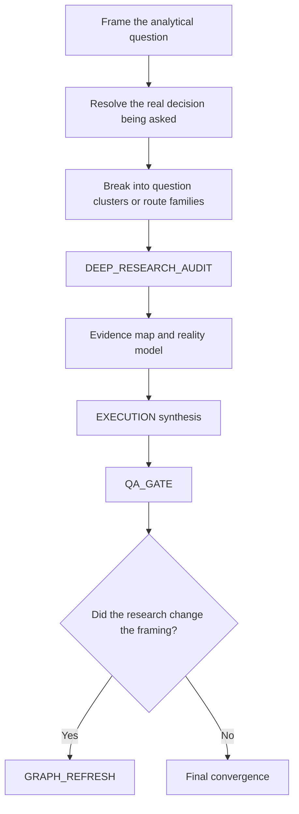

# Generated Graph

This is the graph the framework should generate for a current-reality analytical question.

## Why this graph shape is correct

This branch is dominated by a different risk than writing or coding.

The main problem is not:
- templated output
- merge-heavy implementation work

The main problem is:
- wrong framing
- stale facts
- answering the wrong question well

So the graph emphasizes:
- exact framing
- route clustering
- research before synthesis
- graph refresh when the evidence changes what the question really is

## Key difference from weak analytical workflows

A weak system often does:
- interpret the question loosely
- search a bit
- answer immediately

A stronger graph does:
- resolve what must be decided
- break the task into route families
- build an evidence map first
- only then synthesize
