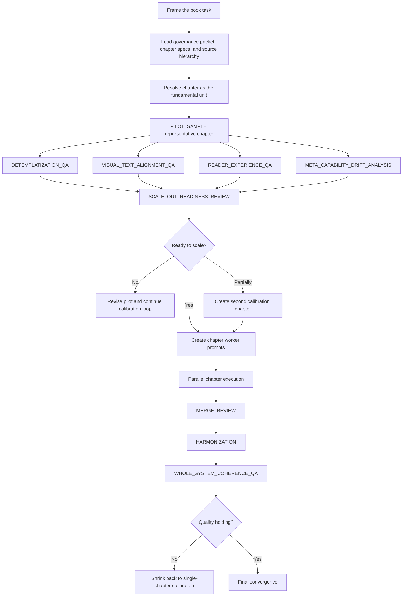

# Generated Graph

This is the graph the framework should generate for the technical-book task.

## Why this graph shape is correct

The graph is built around one central judgment:

> The main risk is not that the book cannot be written. The main risk is that the AI will scale too early and quality will collapse.

So the graph is deliberately conservative at the start.

It does **not** begin with bulk chapter generation.
It begins with:
- unit selection
- one representative chapter
- review of that chapter through writing-aware QA
- a scale-readiness decision

## Node-by-node purpose

| Node | Purpose |
|---|---|
| `Frame the book task` | Resolve the actual success criteria and confirm that quality matters more than raw bulk throughput |
| `Load governance packet...` | Anchor the work to the real standards and source hierarchy |
| `Resolve chapter as the fundamental unit` | Choose the right size of work before any scale decisions |
| `PILOT_SAMPLE` | Produce one representative chapter that exposes the true quality bar |
| `DETEMPLATIZATION_QA` | Check whether the chapter already feels mechanically patterned |
| `VISUAL_TEXT_ALIGNMENT_QA` | Check whether prose, code, diagrams, and captions teach together |
| `READER_EXPERIENCE_QA` | Check whether the chapter is actually engaging and navigable |
| `META_CAPABILITY_DRIFT_ANALYSIS` | Check whether the agent is already underdelivering relative to potential |
| `SCALE_OUT_READINESS_REVIEW` | Decide if the sample shape is stable enough to repeat |
| `Parallel chapter execution` | Only allowed after readiness is proven |
| `MERGE_REVIEW` + `HARMONIZATION` | Prevent chapter families from diverging in standards or style |
| `WHOLE_SYSTEM_COHERENCE_QA` | Check that the whole book works, not just individual chapters |
| `Shrink back...` | If later quality degrades, retreat to a smaller calibrated execution loop |

## Why dependency order alone is not enough

A weak graph might say:
- chapter specs exist
- therefore generate all chapters

This framework says:
- chapter specs may exist, but execution size still matters
- the graph must prove that quality survives scale
- fan-out is earned only after the sample is accepted

That is the core difference.
