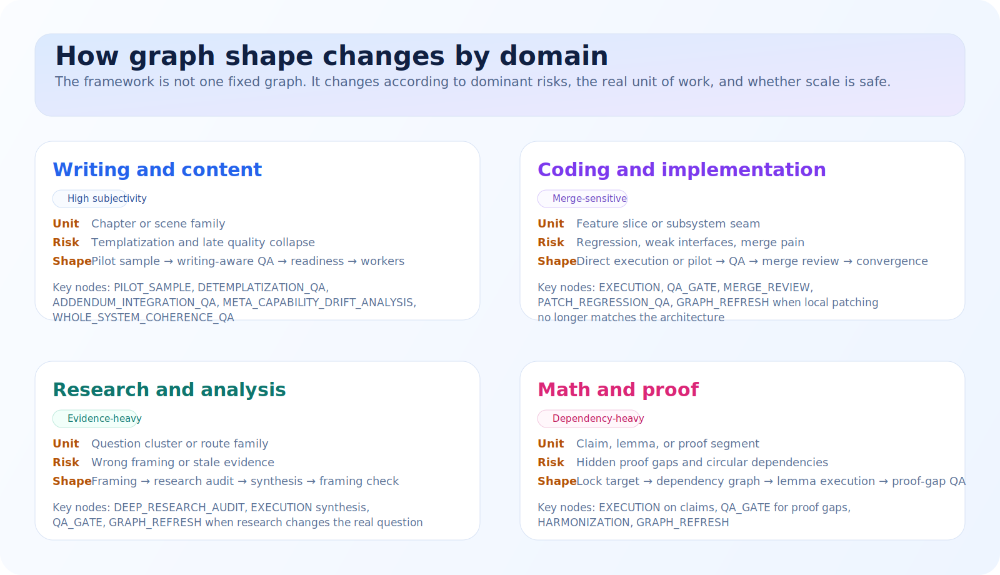
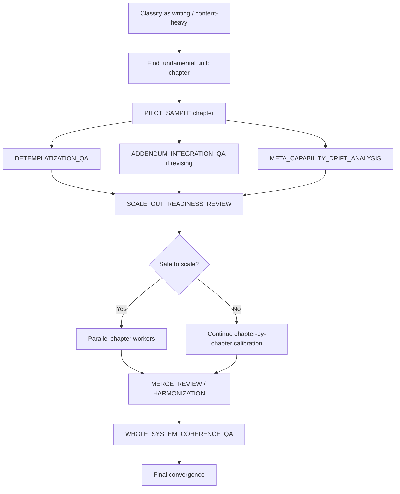
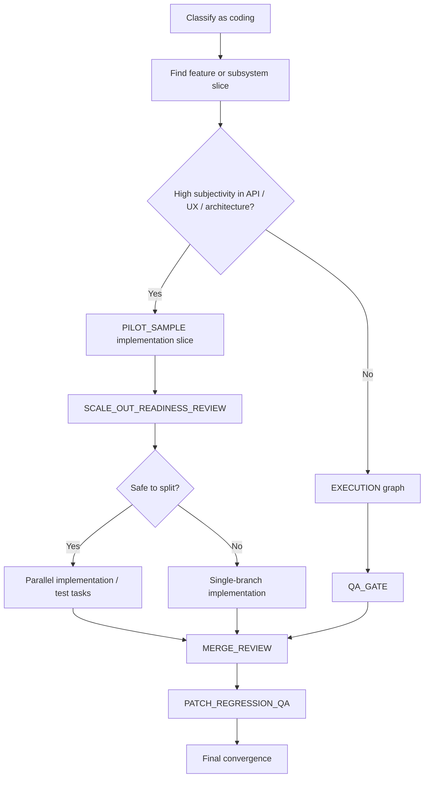
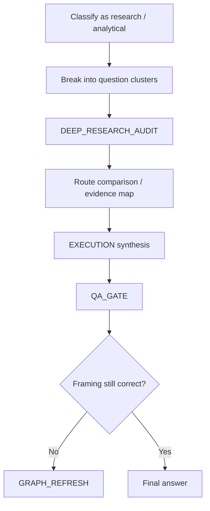
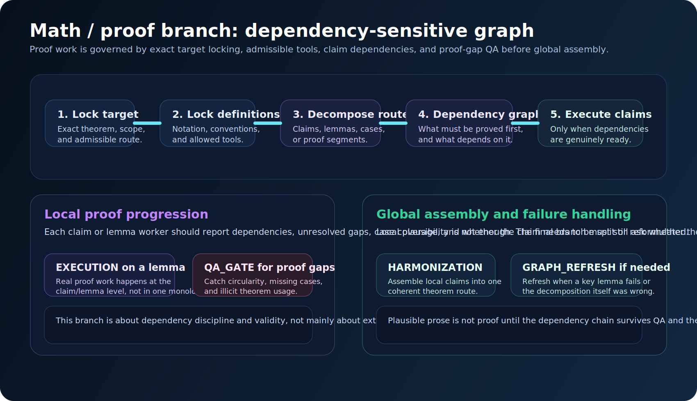

# 01. Graph anatomy by domain

This page explains how the same framework changes shape across different domains.

The key idea is simple:

> A graph should be generated from the problem’s execution physics, not from a fixed template.

  

## Step 1: classify the task correctly

A graph starts by deciding what kind of work this really is.

Examples:
- technical book writing
- coding in an existing codebase
- research that depends on current facts
- mathematical proof work
- product / UX / API design
- mixed work, such as a coding feature with heavy docs and diagrams

This first choice matters because it changes:
- which risks are dominant
- which node types are mandatory
- whether pilot calibration is needed
- how aggressive batching can be

## Step 2: find the real fundamental unit

The graph should not assume that “the whole project” or “whatever the user asked for” is the right execution unit.

Instead, it asks:
- what is the smallest meaningful unit that can succeed well?
- what unit can be judged with confidence?
- what unit can later be repeated without quality collapse?

Examples:
- book → chapter
- novel → scene or chapter
- coding feature → feature slice or subsystem slice
- proof task → lemma or claim
- research memo → route comparison or question cluster

## Step 3: judge whether subjectivity is high

The more success depends on taste or judgment, the more likely the graph should force a pilot sample.

High-subjectivity situations include:
- tone, voice, pedagogy, or creativity
- API shape and ergonomics
- UI / UX quality
- diagram style and explanatory value
- architecture taste in code

Low-subjectivity situations may allow direct execution if the standards are explicit and stable.

## Step 4: decide whether external facts govern the work

If the task depends on current reality, the graph should bring in a research node early.

Examples:
- “Can I go to the moon?”
- “What’s the current product landscape?”
- “Which regulations apply?”

This produces `DEEP_RESEARCH_AUDIT` or equivalent grounding nodes before downstream execution.

## Step 5: decide whether scaling is safe

The graph should not assume that because one unit succeeded, twenty units will also succeed.

Instead, it asks:
- did the sample prove the output shape?
- are standards actually being followed?
- did quality hold through the whole sample?
- are merge-sensitive surfaces now understood well enough to parallelize?

That is what `SCALE_OUT_READINESS_REVIEW` is for.

## Typical graph shapes

### A. Writing-heavy graph

### B. Coding graph

### C. Research / current-facts graph

### D. Proof graph

  

The proof branch is unusually sensitive to:
- hidden assumptions
- circular dependence between lemmas
- proofs of nearby but not identical claims
- local correctness that never assembles into a valid theorem route

That is why the proof graph is dependency-heavy rather than evidence-route-heavy.

## What changes from domain to domain

| Question | Writing | Coding | Research | Proof |
|---|---|---|---|---|
| Main risk | templatization, quality collapse | regression, weak architecture | wrong framing, stale facts | hidden proof gap |
| Pilot likely? | very often | sometimes | sometimes | sometimes |
| Parallel fan-out safe early? | often no | sometimes yes | depends on question independence | only after dependency clarity |
| Global QA crucial? | yes | yes for architecture | yes for synthesis | yes for logical completeness |

## The main takeaway

The framework is not one graph.

It is a graph-generation discipline that changes according to:
- the real unit of successful work
- the amount of subjectivity
- the amount of external grounding needed
- the cost of bad scaling
- the cost of bad merging
