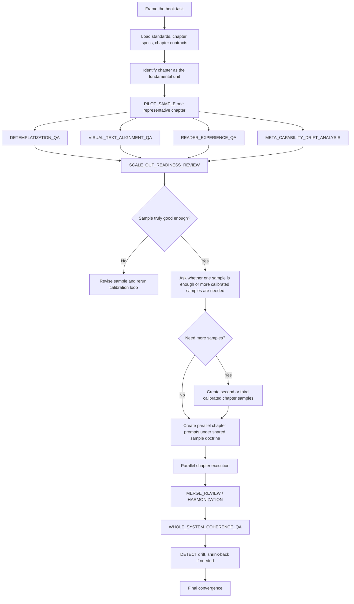

# 02. Example: technical book project

This is the kind of task where the framework is especially useful.

## Scenario

A user wants an AI agent to write a 20-chapter technical book under a full governance packet:
- book standards exist
- chapter specs exist
- style and pedagogy requirements exist
- diagram requirements exist
- output quality matters more than raw speed

This is exactly the kind of task where ordinary bulk generation often fails:
- early chapters may look decent
- later chapters shrink or flatten
- templated rhythms emerge
- diagrams degrade
- standards adherence becomes uneven
- the agent starts sounding like it forgot what good looks like

## The graph that should be generated

## Why this graph shape is chosen

Because the failure is usually not “book writing is impossible.”

The failure is that the AI is allowed to scale before it has demonstrated a stable quality shape.

So the graph deliberately blocks unsafe fan-out until:
- a chapter sample is genuinely good
- the tone and teaching rhythm are accepted
- the code / diagram / prose alignment is proven
- the review nodes say the shape is safe to repeat

## Step-by-step walkthrough

### Step 1: frame and load governance
The graph first anchors:
- standards
- chapter specs
- style / tone requirements
- diagram doctrine
- source hierarchy

What this node produces:
- the governing standards stack
- a resolved list of mandatory requirements
- any ambiguous constraints that must be watched later

### Step 2: choose the real unit
The graph identifies **chapter** as the default execution unit.

This matters because the framework assumes a whole-book bulk run is too unstable for quality-sensitive writing unless quality has already been proven stable.

What this node produces:
- unit choice: chapter
- note that bulk generation is currently blocked
- note that chapter sample calibration is mandatory

### Step 3: run a pilot sample chapter
The graph generates one representative chapter.

Usually this should not be the easiest chapter. It should be a chapter that exposes the quality bar:
- explanatory depth
- examples
- diagrams
- transitions
- standards adherence

What this node produces:
- one real chapter draft
- connected visuals / diagram plan
- evidence of how standards were followed

### Step 4: review the sample hard
The framework then runs the writing-aware review nodes:
- `DETEMPLATIZATION_QA`
- `VISUAL_TEXT_ALIGNMENT_QA`
- `READER_EXPERIENCE_QA`
- `META_CAPABILITY_DRIFT_ANALYSIS`

What they test:
- is the chapter alive or mechanically regular?
- do visuals actually teach, or just decorate?
- is the voice and pedagogy good enough to scale?
- is the AI already underdelivering relative to what the sample could be?

### Step 5: readiness decision
`SCALE_OUT_READINESS_REVIEW` decides whether the chapter sample proved a stable output shape.

Possible outcomes:
- **not ready** → keep iterating the sample
- **partially ready** → create one or two more calibrated samples
- **ready** → create controlled parallel prompts for remaining chapters

This is the key protection against mass low-quality chapter generation.

### Step 6: ask whether one sample is enough
A strong addition in this framework is that the graph can ask whether the accepted sample is sufficient to scale or whether another sample is needed.

Examples:
- if the book has very different chapter types, one sample may not be enough
- if the chapter style is highly subjective, two or three samples may be safer

### Step 7: parallel chapter execution
Once readiness is proven, the graph can safely split into multiple worker branches.

But those workers do not run loosely. Each worker inherits:
- the approved sample
- the standards stack
- the calibration lessons
- the output contract

What each worker must report:
- standards consulted
- evidence checked
- whether any interface or merge-sensitive surface was created

### Step 8: merge and whole-book review
After multiple chapters exist, local chapter quality is no longer enough.

The graph brings in:
- `MERGE_REVIEW`
- `HARMONIZATION`
- `WHOLE_SYSTEM_COHERENCE_QA`

These check:
- repeated rhythms across chapters
- uneven depth or pacing
- diagram system coherence
- consistent standards adherence across the whole book

### Step 9: shrink back if degradation appears
If later chapters degrade, the framework does not blindly continue.

It may do a controlled shrink-back:
- stop parallel fan-out
- return to single-chapter calibration
- regenerate prompts from the stronger sample doctrine

This is a major strength of the framework.

## What this graph prevents

Without this graph, a naïve system might do:
- generate 20 chapters
- review later

With this graph, it instead does:
- prove one chapter
- review it deeply
- decide whether scaling is actually safe
- only then generate more
- shrink back if quality collapses

## Why this matters

This example shows that the framework is not just about dependency order.

It is about **quality-safe scaling**.

For technical books, that is often the difference between:
- a usable book project
- and a long polished-looking failure
