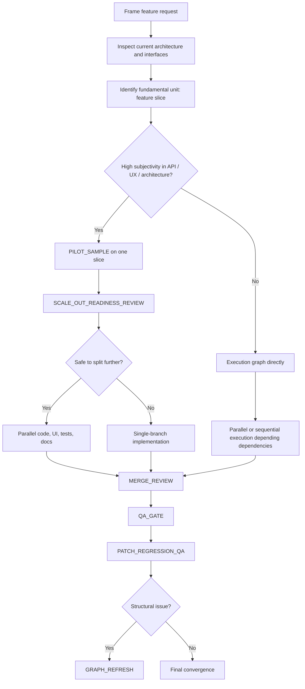

# 03. Example: coding feature delivery

This example shows how the framework behaves on a software task.

## Scenario

A user wants an AI agent to add a new feature to an existing application:
- existing codebase
- UI changes
- API changes
- tests required
- regression risk matters
- code quality matters more than raw speed

Unlike a technical book, this is not automatically a writing-heavy branch. But subjectivity can still matter if the task includes:
- API design taste
- UI / UX feel
- architectural tradeoffs
- migration ergonomics

## The graph that should be generated

## Why this graph is different from the book graph

Coding branches usually do not need the full writing-specific review doctrine.

The main risks are different:
- regressions
- incomplete tests
- bad interface changes
- weak architecture decisions
- merge conflicts across shared surfaces

So the graph focuses more on:
- interface discovery
- dependency ordering
- regression-aware implementation
- merge review
- patch regression checks

## Step-by-step walkthrough

### Step 1: frame the feature correctly
The graph first resolves:
- what the feature really changes
- what code areas are touched
- which interfaces are stable or risky
- where the hidden dependency surfaces are

Output:
- implementation scope map
- affected modules and interfaces
- risk notes

### Step 2: choose the real unit
The graph chooses a **feature slice** rather than “implement the whole feature everywhere.”

Example slices:
- backend contract slice
- one UI flow slice
- one data pipeline slice
- one migration slice

This keeps execution meaningful and testable.

### Step 3: decide whether a pilot is needed
If the task has strong judgment surfaces, the graph may force a pilot slice.

Examples:
- a new public API whose shape matters
- a UX change where quality is subjective
- a structural refactor where architecture taste matters

If not, the graph can skip pilot calibration and go directly to execution.

### Step 4: execute with dependency awareness
The graph then schedules tasks according to dependency order.

Possible ready nodes:
- data model change
- API layer change
- UI consumption change
- test scaffolding
- migration helper

If some branches are independent enough, they can run in parallel.

### Step 5: merge review
Parallel code work often fails at shared interfaces.

So before final convergence, the graph runs `MERGE_REVIEW` to inspect:
- overlapping files
- interface assumptions
- integration conflicts
- duplicated logic
- partial divergence in conventions

### Step 6: QA and regression review
After merging, the graph runs:
- `QA_GATE`
- `PATCH_REGRESSION_QA`

These check:
- correctness
- tests and edge cases
- side effects introduced by fixes
- whether local patches created wider regressions

### Step 7: graph refresh if the issue is structural
If the feature turns out to require a deeper redesign than expected, the graph should not keep pretending the original plan is correct.

That is where `GRAPH_REFRESH` appears.

Examples:
- the API contract assumption was wrong
- the change crosses too many modules to remain a small patch
- the migration cost is much higher than expected

## What this graph prevents

Without structure, a coding agent often:
- changes too much at once
- misses interface edges
- introduces regressions while patching
- merges poorly across shared surfaces

With the framework, the graph makes the agent reason about:
- the real unit of implementation
- whether a pilot slice is needed
- whether parallel branches are actually safe
- when merge review and regression review must happen

## When the graph becomes more like the writing graph

If the coding task also includes:
- major educational documentation
- user-facing narrative explanation
- heavy diagram or tutorial output

then writing-aware review nodes can be attached to that branch only.

So the framework stays flexible without flattening all tasks into the same doctrine.
