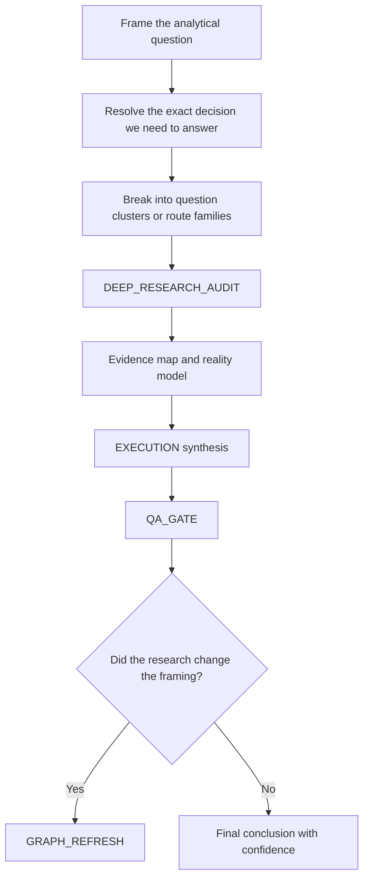
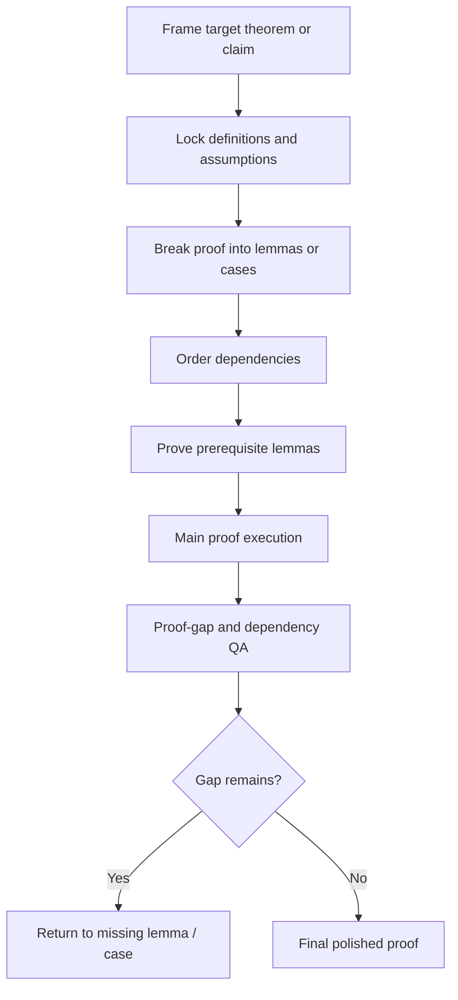

# 04. Example: research analysis and proof work

This page covers two related but different branches:
- analytical questions that depend on current or external reality
- mathematics / proof work that depends on logical dependencies rather than current facts

They often look similar on the surface, but the graph should treat them differently.

---

## A. Research / analytical question

### Scenario
A user asks a current-reality question such as:
- Can I go to the moon?
- What is the best route to solve this market problem today?
- Which current options exist, and which are realistic?

The task is not pure writing or pure coding. The dominant risk is:
- wrong framing
- stale or missing facts
- solving a nearby question instead of the real one

### The graph that should be generated

### Step-by-step

#### Step 1: resolve the real question
The graph first decides what exact question must be answered.

Example:
“Can I go to the moon?” may split into:
- physically possible?
- publicly accessible now?
- financially realistic?
- possible in a lifetime?

This step is crucial because research on the wrong question produces a polished wrong answer.

#### Step 2: break into route families
The graph groups the problem into meaningful investigative routes.

Example route families:
- government pathway
- private commercial pathway
- long-term speculative pathway
- personal feasibility branch

#### Step 3: research before synthesis
The graph inserts `DEEP_RESEARCH_AUDIT` early.

This node gathers:
- authoritative sources
- current status
- factual constraints
- unresolved uncertainties

#### Step 4: synthesize only after grounding
Only after the evidence map exists does the graph produce the answer.

This prevents the agent from writing a plausible-sounding answer from stale memory or vague reasoning.

#### Step 5: refresh framing if research changes the question
Good graphs allow the possibility that research reveals the original framing was wrong.

Examples:
- the real constraint is regulatory, not technical
- the real market choice is between two route classes, not ten products
- the current reality has changed since the user’s mental model

That is where `GRAPH_REFRESH` becomes valuable.

---

## B. Mathematics / proof work

### Scenario
A user asks for a proof, derivation, or mathematical reasoning chain.

Here the dominant risk is not stale facts. It is:
- hidden proof gaps
- undefined terms
- missing lemmas
- circular dependency structure

### The graph that should be generated

### Step-by-step

#### Step 1: lock definitions before proof flow
The graph should not let the agent “kind of know what the statement means.”

It first locks:
- definitions
- assumptions
- notation
- target claim

#### Step 2: break the proof into meaningful units
The graph then identifies the right unit.

Possible units:
- lemma
- case split
- reduction step
- invariant
- contradiction branch

This prevents the proof from becoming one long unstructured stream.

#### Step 3: order dependencies
Unlike a writing graph, the main scaling logic here is usually dependency ordering.

If Lemma 2 depends on Lemma 1, the graph should say so explicitly rather than pretending both can be solved freely in parallel.

#### Step 4: proof-gap QA
After draft proof work, the graph should test for:
- unproved transitions
- missing case handling
- hidden assumptions
- notation drift
- circular reasoning

### Why this graph matters
Without structure, proof-writing agents often produce something that sounds mathematical but quietly jumps over the hard step.

The graph forces the hard step into the visible execution plan.

---

## The main contrast

| Dimension | Research / analytical | Math / proof |
|---|---|---|
| Main grounding need | current or external facts | definitions and logical dependencies |
| Main early node | `DEEP_RESEARCH_AUDIT` | definition locking and lemma graph |
| Main failure | stale or misframed answer | hidden proof gap |
| Graph refresh trigger | research changes framing | dependency structure was wrong |

## Why both belong in the same framework

Even though these branches differ, the framework still applies the same core discipline:
- classify the task correctly
- identify the real unit
- respect the dominant dependencies
- place the right review nodes at the right places
- refresh the graph when the task turns out to be structurally different than first assumed
