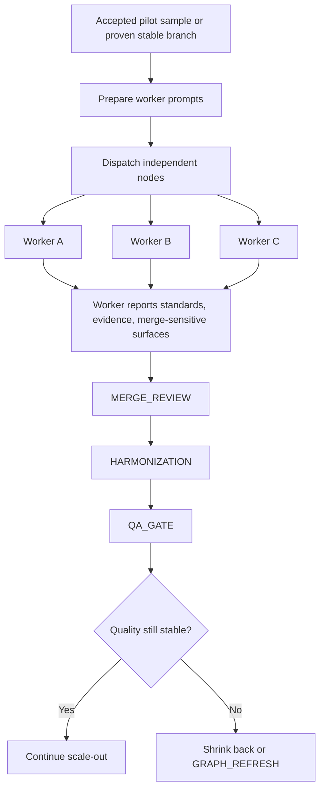

# 05. Parallel execution, merge, and recovery

This page explains what happens after a graph decides that scaling is safe.

The framework is not anti-parallelism.

It is anti-**unsafe** parallelism.

## Scenario

A task already has:
- a valid standards stack
- a correct fundamental unit
- an accepted pilot sample or otherwise proven stable execution shape

At that point, the graph may decide to fan out into parallel workers.

## The graph that should be generated

## What workers are not allowed to do

A worker is not supposed to behave like an isolated genius branch that ignores the shared packet.

Each worker should inherit:
- the standards stack
- the approved sample, if one exists
- the current graph assumptions
- any merge-sensitive warnings
- the required evidence and QA obligations

This is why the framework distinguishes between:
- an orchestrator branch
- worker branches

## What every worker must report

The packet expects each worker to say:
- which standards or sections governed the work
- what evidence was checked
- what assumptions were used
- whether any interface or merge-sensitive surface was created

That last one is especially important, because merge pain usually comes from hidden shared surfaces.

## When parallel fan-out is safe

Parallel execution is a good fit when:
- the unit boundaries are real
- the sample has proven the output shape
- dependencies are understood
- interface overlap is limited or explicitly governed
- the merge plan is known in advance

Examples:
- multiple book chapters after sample calibration
- independent proof lemmas after dependency ordering
- multiple coding tasks that share stable interfaces
- independent research subquestions with later synthesis

## When parallel fan-out is not safe

It is usually unsafe when:
- the task is still highly subjective and unresolved
- the sample has not yet proved the output shape
- merge-sensitive surfaces are not understood
- the workers would duplicate the same design decisions independently
- later work quality is already degrading

In those cases, the graph should stay smaller for longer.

## Merge review and harmonization

Once worker outputs exist, the graph does not jump straight to finalization.

It inserts:
- `MERGE_REVIEW`
- `HARMONIZATION`

### MERGE_REVIEW checks
- conflicting assumptions
- interface collisions
- duplicated logic or duplicated content
- different interpretations of the same standard
- hidden contradictions across branches

### HARMONIZATION does
- normalize shared surfaces
- align language and conventions
- resolve overlaps cleanly
- create a coherent combined artifact

## Recovery when scale starts to degrade quality

A strong framework must know how to back off.

If quality begins to collapse after fan-out, the graph should not keep scaling just because parallelism was already started.

Possible recovery actions:
- stop opening new worker branches
- shrink back to a single-unit calibrated loop
- regenerate worker prompts from the better sample doctrine
- refresh the graph if the original split was wrong
- rewrite the merge plan if shared surfaces were underestimated

## Example recovery patterns

### Writing project
- later chapters become thinner and more templated
- stop bulk chapter creation
- return to one-chapter calibration
- update worker prompts from the strongest accepted sample
- resume only after quality is stable again

### Coding project
- integration failures reveal that interfaces were not stable enough
- stop independent feature branches
- refresh graph around shared API layer first
- re-split after the interface is anchored

### Research synthesis
- supposedly independent subquestions turn out to depend on a missed framing assumption
- run `GRAPH_REFRESH`
- re-cluster the questions before continuing

## The core philosophy

Parallelism is valuable, but only when the graph has earned it.

A mature task graph framework should know:
- when to branch
- when to merge
- when to harmonize
- when to stop scaling
- when to retreat to a smaller better-calibrated unit

That is what turns multi-agent work from raw speed into usable structured execution.
