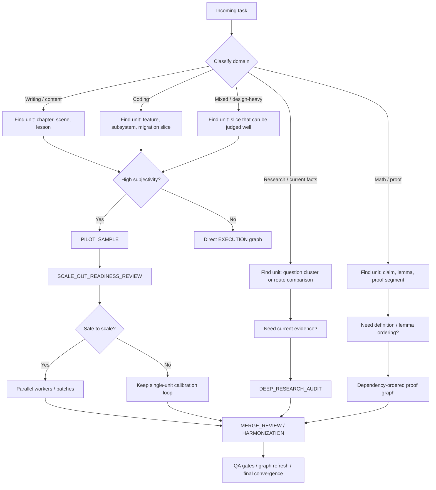

# AI Task Graph Wiki

This wiki shows how the framework behaves on real classes of work, not just in abstract node lists.

It answers three practical questions:
- what graph would be generated for a given kind of task
- why that graph shape is chosen
- what each node would actually do step by step

## Reading map

- [01. Graph anatomy by domain](01-graph-anatomy-by-domain.md)
- [02. Example: technical book project](02-example-technical-book-project.md)
- [03. Example: coding feature delivery](03-example-coding-feature-delivery.md)
- [04. Example: research analysis and proof work](04-example-research-analysis-and-proof.md)
- [05. Parallel execution, merge, and recovery](05-parallel-execution-and-recovery.md)

## What this wiki emphasizes

The framework is not trying to generate the same graph for every problem.

It changes shape based on:
- task type
- real fundamental unit of work
- amount of subjectivity in success judgment
- external-fact dependence
- merge sensitivity
- scale risk
- quality-degradation risk

## Quick intuition

A good task graph is not just dependency order.

It also decides:
- what size of work can still succeed with high quality
- whether a pilot sample must be accepted before scale-out
- whether review must happen locally, globally, or both
- when the graph itself should change instead of continuing to patch outputs

## Domain-to-graph summary

| Domain | Usually fundamental unit | Pilot sample likely? | Special nodes that tend to appear |
|---|---|---:|---|
| Technical book / long writing | Chapter or chapter section family | Very often | `PILOT_SAMPLE`, `DETEMPLATIZATION_QA`, `ADDENDUM_INTEGRATION_QA`, `WHOLE_SYSTEM_COHERENCE_QA` |
| Coding feature work | Feature slice / subsystem slice | Sometimes | `QA_GATE`, `MERGE_REVIEW`, `PATCH_REGRESSION_QA`, `GRAPH_REFRESH` |
| Research / current-facts analysis | Route comparison or question cluster | Often | `DEEP_RESEARCH_AUDIT`, `QA_GATE`, `GRAPH_REFRESH` |
| Mathematics / proof | Claim, lemma, proof segment | Sometimes | definition-locking execution, dependency graph, proof-gap QA |
| Product / UX / API design | Judgable slice | Very often | `PILOT_SAMPLE`, readiness review, user-feedback-informed scale-out |

## Note on framework changes

While building this wiki, no new graph doctrine appeared necessary. The current packet already had the right concepts for these walkthroughs, so this wiki explains and demonstrates the framework rather than patching it again.
